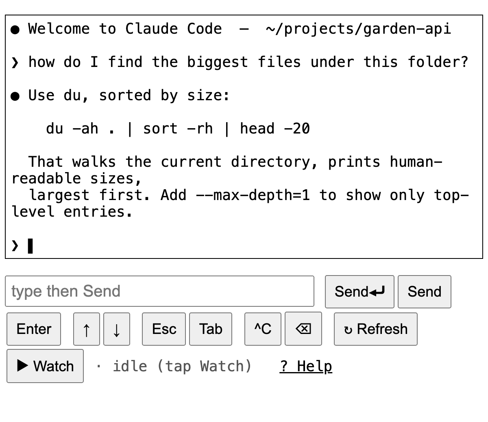

# kindle-term

Drive a terminal — or a live **Claude Code** session — from a **2010 Kindle**, or honestly any browser back to ~2009. No WebSocket, no JS framework, no canvas. Just HTML, forms, and `tmux`.

> Built because the Kindle 3 e-ink browser (`AppleWebKit/531`, 2010) renders HTML and runs basic JS, but has **no WebGL and no working WebSocket** — so every modern web terminal (ttyd, Blit, wetty, gotty) shows a blank page. This one is dumb on purpose and just works.



## How it works

```
your browser ─▶ [auth: Cloudflare Access / reverse proxy] ─▶ [cloudflared tunnel]
             ─▶ app.py (127.0.0.1:8882) ─▶ tmux session ─▶ your shell / Claude Code
```

- `app.py` reads the visible `tmux` pane with `tmux capture-pane` and renders it inside a `<pre>`.
- Buttons POST keystrokes, which are injected with `tmux send-keys`.
- A content-hash **auto-refresh** keeps reloading while the screen is changing (so you watch output stream in) and **auto-stops** once it goes still — friendly to e-ink, which hates constant redraws.
- ~90 lines, **Python standard library only**, zero dependencies.

## ⚠️ Security — read this

This serves a **writable terminal**, i.e. **remote code execution** for anyone who can reach it.

- Keep it bound to **`127.0.0.1`** (the default).
- **Always** put authentication in front — Cloudflare Access, an authenticated reverse proxy, or a VPN. Never expose it raw to the internet.
- The POST endpoints are **CSRF-protected** (double-submit token: a cookie + a hidden form field that must match), so a cross-origin page can't drive your terminal using your authenticated session. Note that auth alone does **not** stop CSRF — the browser attaches your auth cookie automatically — which is why the token is built in. The cookie is `HttpOnly; SameSite=Strict`, and `Secure` when you set `KT_SECURE=1` (do that behind HTTPS).
- **`127.0.0.1` is not a boundary against *co-located* processes.** Anything else on the host that can reach loopback — another local service, or a `--network=host` Docker container (bridge-networked containers can't, by default) — can POST to the port **directly, bypassing your auth proxy entirely**. CSRF can't help there: such an attacker crafts the whole request. If the host also runs internet-facing services (a media server, cloud storage, …), treat a compromise of those as a path to this terminal. Mitigate (any of): run it where nothing untrusted shares the host; ensure no container is `--network=host`; restrict the port with a host firewall that allows only your proxy's process (match by uid or cgroup) and drops other local connections; have the app listen on a `0600` **Unix socket** your proxy connects to (a filesystem boundary even host-networked containers can't cross); and/or require a proxy-injected secret header (below).
- **Run it as a non-root user** (see the `systemd/` examples). Otherwise a bug — or the path above — is a *root* shell, not a contained account.
- **Optional: require a proxy-injected secret header.** Set `KT_AUTH_HEADER` + `KT_AUTH_SECRET`; the app then **403s any request missing that header**, so a process reaching the port *directly* (not through your proxy) is rejected. Have your trusted proxy inject the header server-side — the browser never sees it, so it stays ancient-browser-compatible:
  - **nginx:** `proxy_set_header X-KT-Auth your-secret;`
  - **Caddy:** `header_up X-KT-Auth your-secret`
  - **Traefik:** a `headers` middleware with `customRequestHeaders`.
  - **Cloudflare:** injecting a *request* header needs Transform Rules or Snippets, which are **paid** (Pro+); on the Free plan use an OS-level option above (host firewall / Unix socket) instead.

## Quick start (local)

```bash
tmux new-session -d -s claude          # or any session name
python3 app.py                         # serves http://127.0.0.1:8882
# open http://127.0.0.1:8882 in a browser on the same machine
```

Config via env vars (defaults shown): `KT_SESSION=claude`, `KT_HOST=127.0.0.1`, `KT_PORT=8882`, `KT_TITLE=<session>`.

## Remote access (the Kindle use case)

1. Run `app.py` bound to localhost — see `systemd/kindle-term.service.example`.
2. Expose it with a **Cloudflare Tunnel**: install `cloudflared`, create a named tunnel, add a Public Hostname → `http://localhost:8882`. The token goes in an env file (`.env.example`, `systemd/cloudflared.service.example`). No inbound ports are opened.
3. Gate it with **Cloudflare Access**: add a self-hosted application for your hostname with a policy (Google SSO, one-time PIN, your IdP, …). Now only you can reach it.

For a tmux session that survives reboots, see `systemd/claude-session.service.example`.

## Controls

| Button | Does |
|---|---|
| **Send⏎** | send your typed text **+ Enter** (submit) |
| **Send** | send your text **without** Enter |
| **Enter / ↑ / ↓ / Esc / Tab / ^C / ⌫** | send that single key (history, menus, interrupt, …) |
| **↻ Refresh** | re-read the screen once |
| **▶ Watch** | auto-refresh while the screen changes, auto-stop when idle |

A full in-app guide lives at `/help`.

## Bonus: Claude account switcher (optional)

If you drive **Claude Code** and keep two accounts (e.g. work + personal) and don't want to mix them, `bin/claude-acct` snapshots and swaps the Claude login (`~/.claude/.credentials.json`) cleanly — leaving your MCP/plugin logins untouched — and `bin/cwork` / `bin/cpers` switch + relaunch. Claude-specific; skip it if you're driving a plain shell. Setup is in the header of `bin/claude-acct`.

## Why "dumb on purpose"

Capability probe on a Kindle 3 (`AppleWebKit/531`, 2010): HTML ✓, basic JS ✓, **WebGL ✗, WebSocket ✗**. Modern web terminals stream over a WebSocket; this one never opens one — it's plain page loads and `tmux`. That's the whole trick.

## License

MIT © Alessandro Grassi
